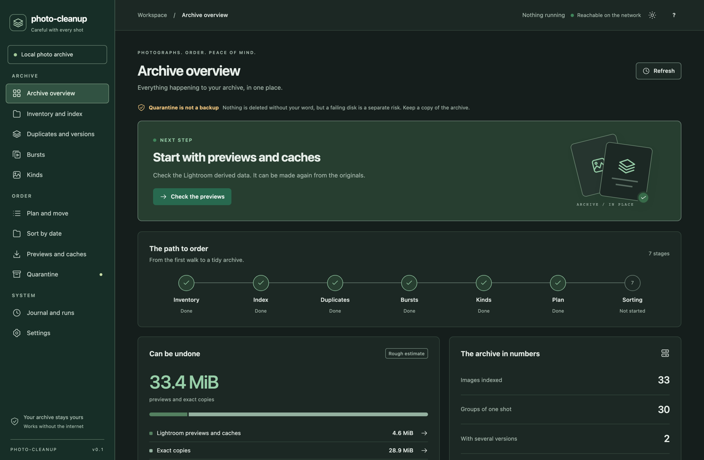
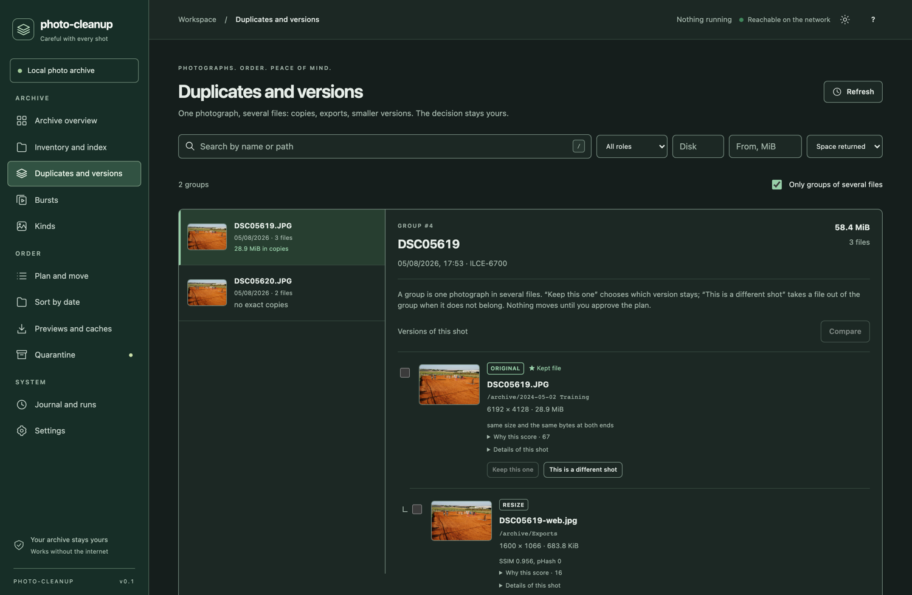
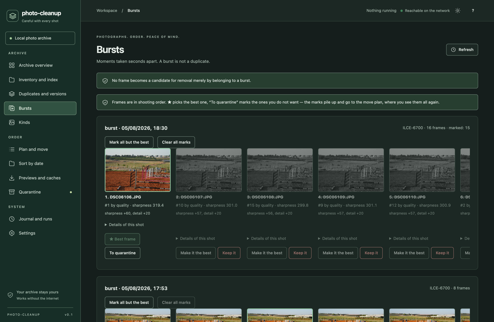
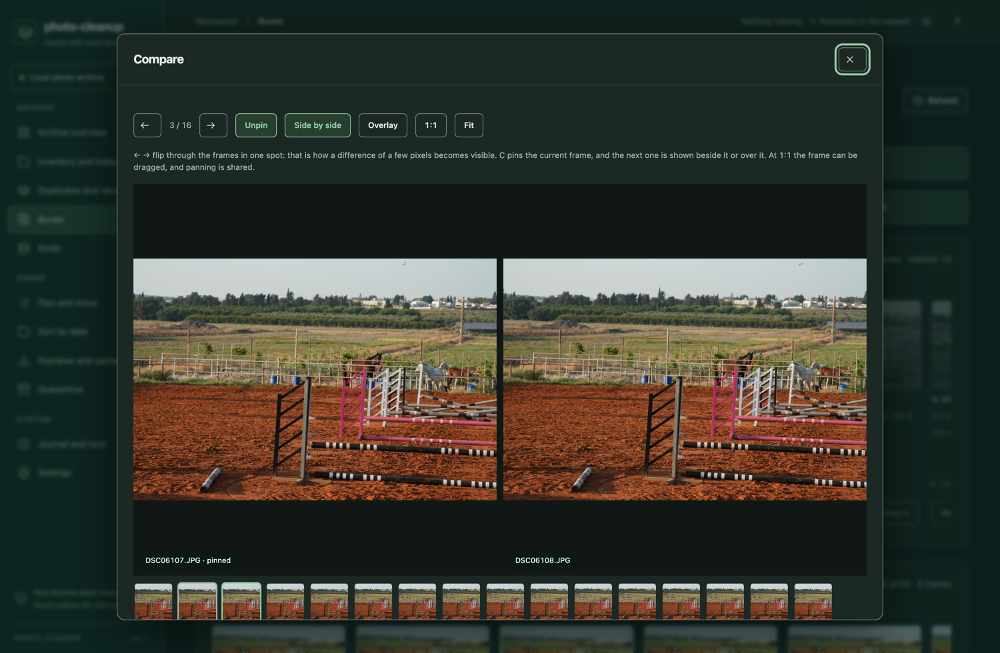
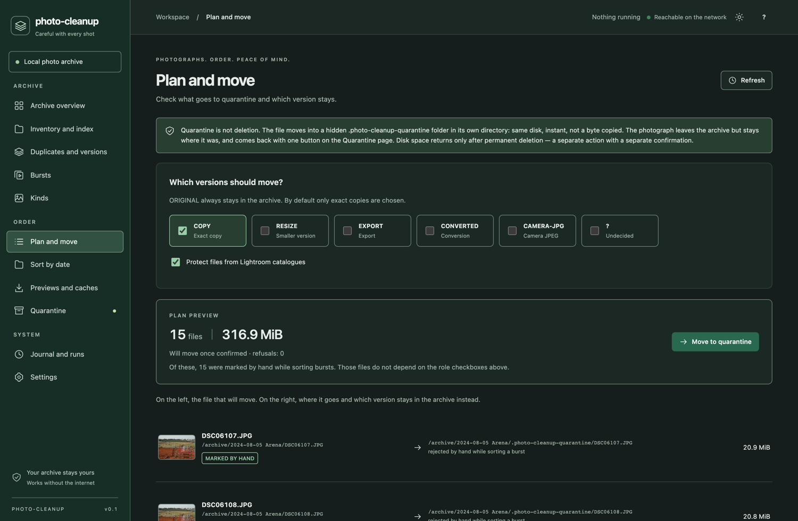
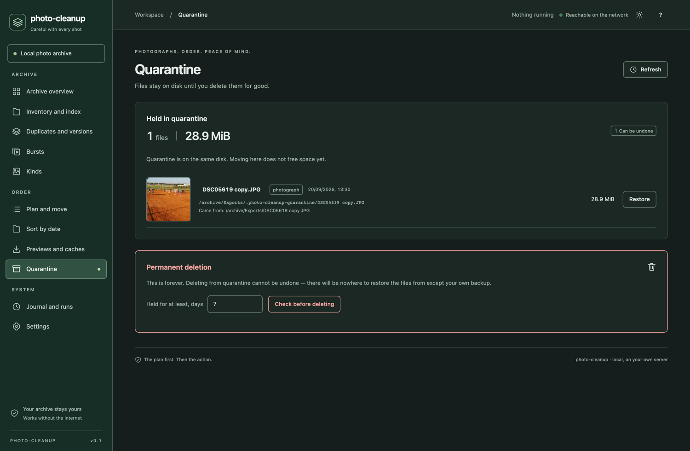

# photo-cleanup

Sorting out a large photo archive: duplicates, bursts, and the gigabytes of
derived data that can be made again. Runs on the machine that holds the
photographs, reachable from a browser, with no internet involved.

*[Читать по-русски](README.ru.md) · the interface speaks both languages and
switches in Settings.*



---

## What it does

**Finds the versions of one photograph.** A raw frame, the JPEG the camera
wrote beside it, a DNG conversion and a Lightroom export are four different
objects describing one moment. Only an exact copy of one of them is rubbish,
and the tool says which is which rather than calling them all duplicates.



**Takes one sentence about a folder for an answer.** Ten thousand groups is
ten thousand presses, and the person who owns the archive usually knows one
thing about it: the photographs live over there, and everything else is a copy
of them. The **Archive tree** screen shows the scanned tree the way a file
manager would — folders, what they weigh, the frames inside them — and every
folder has a button saying "The originals are here". The mark reaches all the
way down: any file under it counts as an original, and every group holding
such a file keeps it. One more button then quarantines the exact copies of
what those folders hold, wherever in the archive they lie.

**An array is one structure, not three.** On Unraid the photographs live on
`/mnt/disk1`, `/mnt/disk2`, `/mnt/disk3` — separate filesystems, because a
move has to stay on one spindle to be a rename. But
`D/разобрано/даня/театр` is one folder spread over the disks, and the tree
shows it as one node, saying how much of it each disk holds. The mark is
stored as a path *relative to a root*, so it covers that folder on every disk
at once — including one added to the array tomorrow, with no rule to move.
When the originals really are on one disk and the others hold copies, open
"This folder, disk by disk" and mark that one; such a mark reaches no further
than the disk it names.

The mark is a rule, not a press. It is stored, it survives the groups being
rebuilt, and it is applied again afterwards, so files indexed into that folder
tomorrow become originals too. Taking it back undoes what it decided and
leaves alone what you decided by hand. Other versions of a shot — a scan and
the export made from it — are never swept up by it: only a person can tell
those apart, so the rule moves the kept file only where the pixels match and
reports the rest as a number.

**Tells a burst from a duplicate.** Seventy frames of a horse clearing a jump
are seventy photographs. The tool groups them, ranks them on sharpness,
clipping and detail, and lets you flip between two frames in the same spot —
which is the only way a difference of a few pixels becomes visible.



Frames are listed in shooting order, not in quality order: read out of
sequence, the subject jumps back and forth and the frame you are looking for
could be anywhere. ★ picks the keeper, and the ones you do not want are marked
and collected into the move plan.



**Accounts for derived data.** Lightroom previews, caches, system junk. It
recognises a bundle by its directory name and never walks inside: twenty-four
thousand preview files become one line in the inventory. It also refuses to
touch what cannot be rebuilt.

**Sorts what is left by date**, into `YYYY/YYYY-MM-DD_event`, reversibly.

What it does **not** do: understand what a picture is about. "A photo of a
utility meter" is a question about meaning, and answering it needs a model
this tool does not have. Everything here is measured off the pixels, and it
stops where measurement stops.

## Nothing is deleted

Moving to quarantine puts a file in a hidden `.photo-cleanup-quarantine`
folder **in its own directory**: same filesystem, so the move is a `rename(2)`
— instant, and not a byte copied. The photograph leaves the archive and stays
on disk. One button brings it back.

Space returns only at `purge`, which is a separate action, after a holding
period, behind a typed confirmation.



Every candidate says which file makes it redundant and why. Frames you marked
by hand say so, and do not depend on the role checkboxes above.



| | |
|---|---|
| `*.lrcat-data` | **never removed** — AI masks and Denoise, nothing regenerates them. Enforced in code, no policy lifts it |
| an open catalogue | a `*.lrcat.lock` beside it means Lightroom has it open → the bundle is blocked |
| Smart Previews | removable only when **every** master the catalogue references is found on disk |
| changed since the scan | skipped, never moved |
| quarantine on another disk | refused: the move would silently become a copy |
| deletion | `purge` only, with an explicit `--yes`, only after the holding period |

Every move is written to a journal **before** the filesystem is touched, so an
interrupted run leaves a row pointing at exactly what to inspect.

One writer at a time, whichever way you use it: while a job is running — or a
command is writing — the archive is locked for writing, and the second one is
refused and told who holds it. Reading goes on as usual. The lock is the
operating system's, so killing the process releases it.

### What the command line does not promise

The interface hands a reviewed plan back with a token and refuses to carry out
anything else. `apply --yes` has no such token: it works out the plan there and
then and carries out *that* plan, which is what it prints just above. If the
index changed since you last looked, what moves is what the new plan says.

`purge --yes` is the whole confirmation, where the interface asks for a word to
be typed.

This is on purpose: a command line is for people who mean it, and for scripts
that cannot type words. Use the interface when you want the plan you looked at
to be the plan that runs.

## Quick start

```bash
cargo build --release
./target/release/photo-cleanup --db pc.db serve
```

Open `http://127.0.0.1:8080`, point it at your folders, press **Do
everything**: inventory → index → duplicates → bursts → kinds, as one job.
Nothing moves; you approve the move plan separately.

Build with `--release`. Without optimisation the image decoding runs about
fifty times slower, which turns a two-minute pass into two hours. `cargo run`
is fine — the `dev` profile already builds the pixel crates optimised.

Indexing reads and decodes in the scheduler's background class and leaves one
core free, so the machine stays usable. `--workers` changes the thread count,
as does the setting in the interface.

Stopping is safe: what was read is in the database, and the next run carries on
from where it stopped rather than starting again.

## Docker and Unraid

Images are built for every tag, for `linux/amd64` and `linux/arm64`:

```bash
docker pull ghcr.io/imcitius/photo-cleanup:latest
```

```bash
docker run -d --name photo-cleanup --user 99:100 -p 8080:8080 \
  -v /mnt/user/appdata/photo-cleanup:/data \
  -v /mnt/disk1:/mnt/disk1 \
  -v /mnt/disk2:/mnt/disk2 \
  ghcr.io/imcitius/photo-cleanup:latest
```

On Unraid the easiest route is Community Applications: search for
**photo-cleanup**, press Install, and set the paths in the form. Failing that,
copy
[`templates/photo-cleanup.xml`](templates/photo-cleanup.xml) into
`/boot/config/plugins/dockerMan/templates-user/` and add the container from
the template list.

Two things about the mounts are not cosmetic:

* **`/mnt/diskN`, never `/mnt/user`.** The union filesystem hides which
  physical disk a file is on, and quarantine is a `rename(2)` that only works
  inside one filesystem. Through `/mnt/user` the move would become a copy —
  the tool notices and refuses.
* **The photo shares must be writable.** Quarantine puts a file in a hidden
  folder in its own directory. Nothing is deleted without a confirmation, but
  the archive is written to.

`--user 99:100` is `nobody:users` on Unraid, so moved files and the thumbnail
cache keep ordinary ownership rather than root's.

If you would rather not use Docker, every release carries static binaries for
Linux (amd64, arm64) and for macOS on Apple Silicon. No dependencies: unpack
and run.

## Windows

Download `photo-cleanup-windows-x64.zip` from the
[latest release](https://github.com/imcitius/photo-cleanup/releases/latest),
unpack it anywhere, and double-click **Start photo-cleanup.bat**. The browser
opens by itself.

One `.exe` and nothing else to install: the interface is compiled into the
binary. The index and the thumbnail cache are written next to it, so moving or
deleting that folder leaves nothing behind.

A note on what Windows cannot tell us. Unix names a filesystem with a device
number; Windows has no cheap equivalent, so the drive letter stands in. That is
the right granularity for both things this depends on — which disk to read in
parallel, and whether a move is a rename — and the gap is a folder mounted into
another volume's tree, which a home archive rarely has. Hard links are not
detected there either: without an inode, two names for one file are counted
twice rather than mistaken for each other.

## How it reads an archive

Reading is deliberately cheap. A raw file is 25 MB of sensor data wrapped
around a JPEG preview; the directories saying where that preview sits are at
the front, so one small head read plus one seek replaces reading the whole
file. On a real archive that is about half the bytes never touched.

From each frame it keeps: dimensions, container, EXIF, a partial content hash,
a pixel hash normalised for rotation, perceptual hashes whole and by quarters,
a 384 px thumbnail, and measurements of sharpness, clipping, entropy,
contrast and saturation.

Grouping then works on evidence, strongest first: identical bytes, identical
pixels after rotation, a shared XMP `OriginalDocumentID`, the same name and
the same moment, perceptual similarity confirmed by SSIM.

## Bursts are not duplicates

No frame becomes a candidate for removal merely by belonging to a burst. The
ranking exists to answer "which of these is the keeper", and it is only
meaningful *within* one burst: sharpness depends on resolution, so comparing a
24 MP frame to a web export tells you nothing.

Pixel-shift sets are recognised and protected outright — four frames of one
scene that the camera merges later look identical and must never be thinned.

Marks you make by hand — the best frame, the ones you do not want — go into
the move plan and survive the next pass.

## Kinds: what measurement can and cannot say

A scan has a physical signature: flat light, white paper, a histogram that
splits cleanly into ink and page, and no colour. That is detectable, and it is
detected.

A page someone *photographed* is not. Measured against real files, a dim
notebook page and a low-saturation landscape are the same numbers — and the
landscape scores *more* line structure, because grass and fencing produce
contrast reversals by the hundred. An earlier version tried anyway and filed
nine hundred photographs of a sand arena under "documents". There is no
threshold in between, so the tool does not claim one.

## Development

Rust workspace plus a React interface built with Vite. `crates/pc-api/web/dist`
is committed, so building the binary needs no Node.

See [CONTRIBUTING.md](CONTRIBUTING.md) for the interface, and
[DESIGN.md](DESIGN.md) for why the pipeline is shaped the way it is.

```bash
cargo test --workspace
cd crates/pc-api/web && npm ci && npm test
```

The interface dictionaries live in `crates/pc-api/web/src/locales`. Russian is
the reference: it is `as const`, and a translation is checked against its keys
at compile time, so a missing string fails the build. Text the server draws —
stage names, refusal reasons, labels — is translated at the call site with the
`tr!` and `tf!` macros, both languages side by side.

## Licence

MIT.
